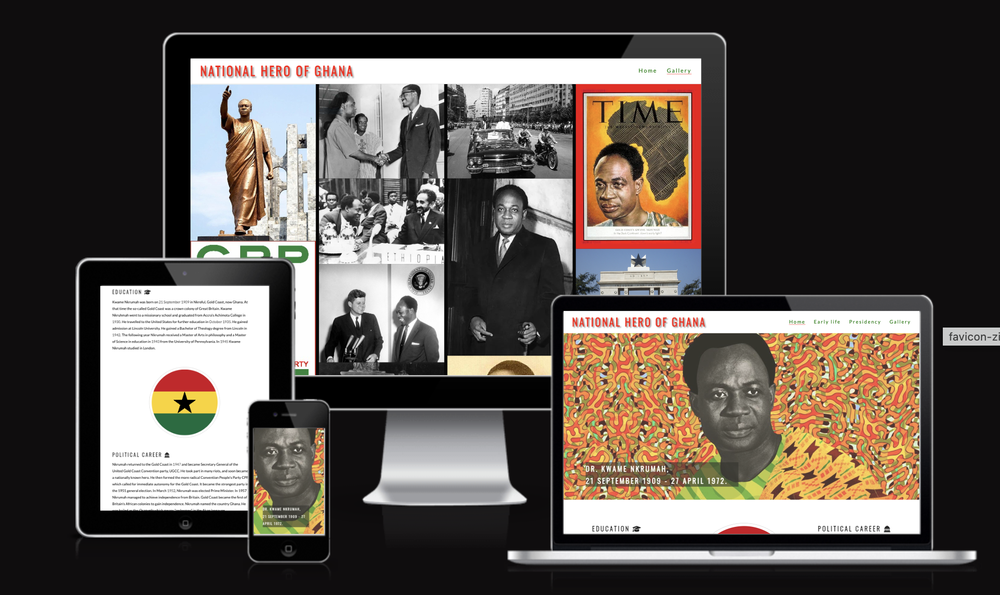

# Gold Coast's Kwame Nkrumah

## Description

This project is a historical exploration into the life and achievements of Dr. Kwame Nkrumah, the first prime minister and president of Ghana. The website provides a detailed account of his early life, education, political career, presidency, and contributions to Ghana and the wider African continent. It offers a blend of engaging narrative and interactive features, offering a dynamic and educational experience.

## Features

The website is structured into various sections, each focusing on a different aspect of Kwame Nkrumah's life:

1. **Home**
   - The landing page introduces the user to Kwame Nkrumah with a prominent header and heroic image of Kwame Nkrumah and his lifespan.
   - An intuitive navigation menu, which facilitates quick and easy access to different sections of the website.

2. **Early life**
   - A brief summary of Nkrumah's upbringing and education.
   - An overview of Nkrumah's political journey from the Gold Coast to becoming the first President of Ghana.

3. **Presidency**
   - This section dives into Nkrumah's tenure as the President of Ghana and his impact on the nation and his Pan-African vision.

4. **Gallery**
   - A dedicated gallery section, which offers users a visual tour of Dr. Nkrumah's life.

5. **Footer**
   - Contains additional resources for further reading.
   - A documentary link to learn more about Kwame Nkrumah's life.
   - Credit to the developer.

## Testing

The website has been tested on various devices ( desktop, tablet, and mobile ) to ensure compatibility and responsiveness. HTML and CSS code has been validated using the W3C Markup Validation Service to avoid any syntax or structural issues.

### Validator Testing

- HTML: No errors were returned when passing through the official [W3C validator](https://validator.w3.org/).
- CSS: No errors were returned when passing through the official ( Jigsaw ) validator.

## Deployment

This website was deployed to Github pages. The steps to deploy are as follows:

- In the GitHub repository, navigate to the Settings tab
- From the source section drop-down menu, select the Main Branch
- Once the main branch has been selected, the page will be automatically refreshed with a detailed ribbon display to indicate the successful deployment.

The website can be accessed from the following link - [https://michael-takyi23.github.io/Gold-Coasts-Kwame-Nkrumah/](<https://michael-takyi23.github.io/Gold-Coasts-Kwame-Nkrumah/>)

## Credits

### Contents

Information for the content of the page was sourced from the following websites :

- [Wikipedia](https://en.wikipedia.org/wiki/Kwame_Nkrumah#Ghanaian_independence)
- [Britannica](https://www.britannica.com/biography/Kwame-Nkrumah)
- [Youtube Documentary](https://youtu.be/TMY0iTcspNA)
- The icons used on the site were sourced from [Font Awesome](https://fontawesome.com/).

### Media

- The hero image was sourced from [https://annenberg.usc.edu/news/spotlight/they-dont-tell-us-about-nkrumah](https://annenberg.usc.edu/news/spotlight/they-dont-tell-us-about-nkrumah)
- images for the gallery was sources from [Wikipedia](https://en.wikipedia.org/wiki/Kwame_Nkrumah#Ghanaian_independence)
