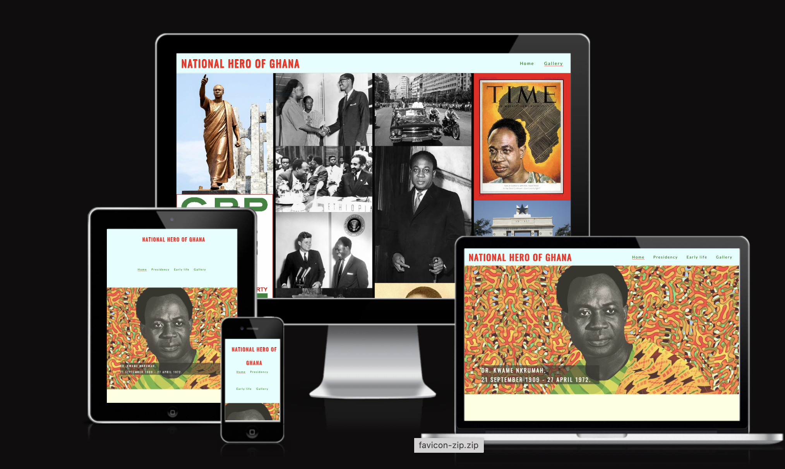
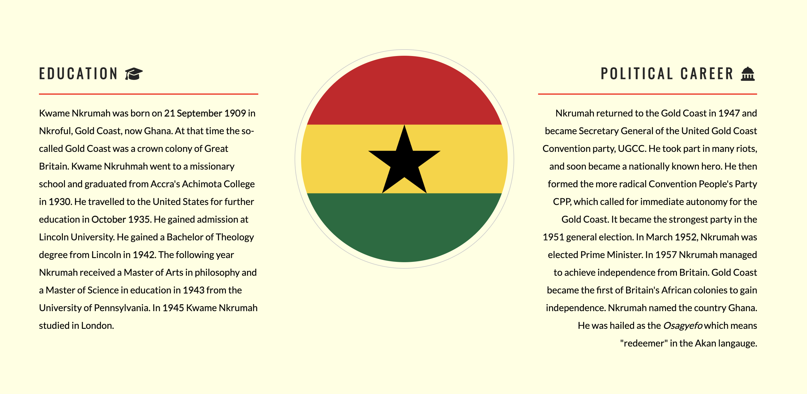
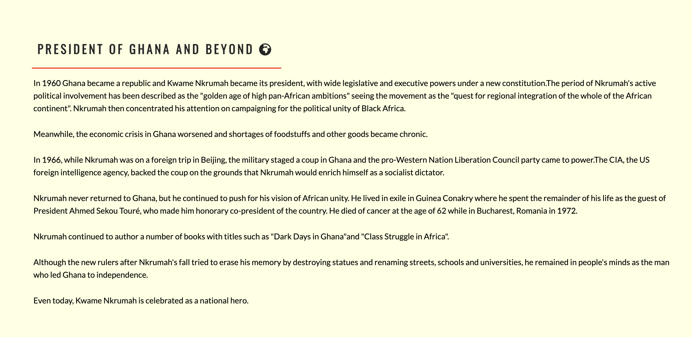
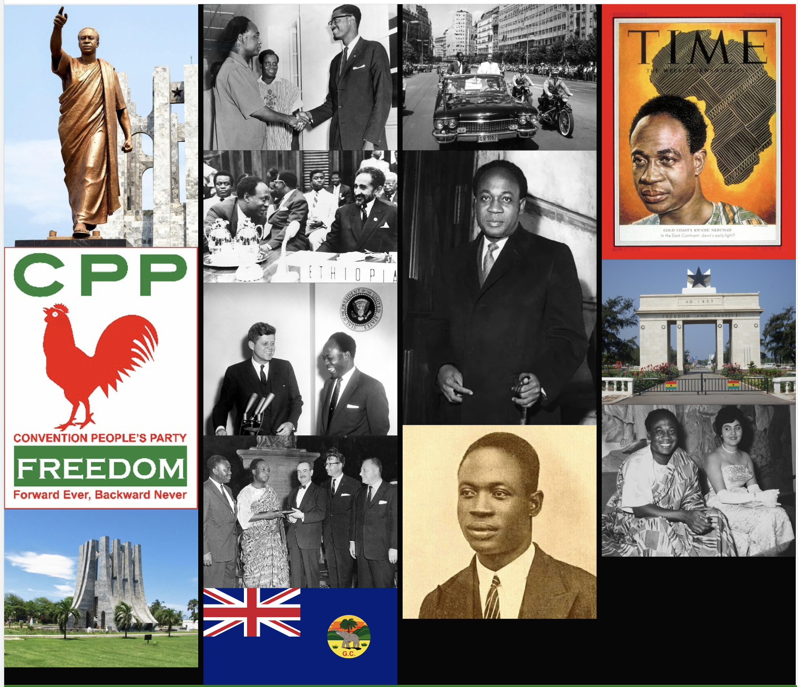
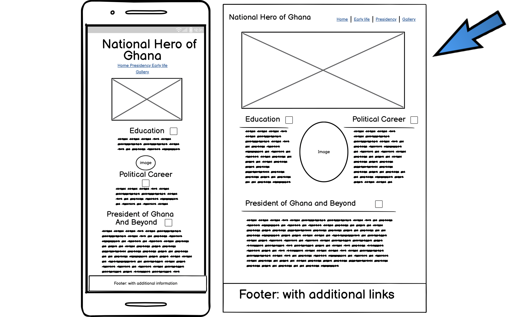
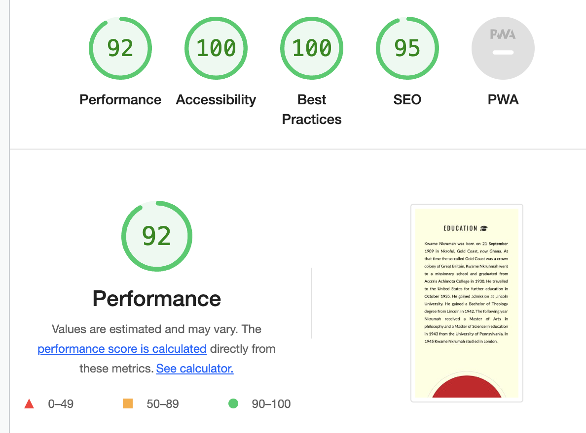

# Gold Coast's Kwame Nkrumah

## Description

This project is a historical exploration into the life and achievements of Dr. Kwame Nkrumah, the first prime minister and president of Ghana. The website provides an evidence based information mixed with a timeline of his early life, education, political career, presidency, contributions to Ghana and the wider African continent. It offers a blend of engaging narrative and a beautiful gallery offering a dynamic and educational experience.

## Purpose 

The goal of the site is to provide a reliable source of information pertaining to the history of Dr. Kwame Nkrumah. 

## UX Design

### User stories

**As a first time user**

- I want to easily understand the main purpose of the site and learn more about the topic.
- I am interested in the historical facts surrounding the person.
- I want to be able to easily navigate and find content.

**All users want to be able to access and comfortably view the website on mobile devices**

## Features

The website is structured into various sections, each focusing on a different aspect of Kwame Nkrumah's life:

1. **Home**
   - The landing page introduces the user to Dr. Kwame Nkrumah.
   - A prominent header with an etching logo appearance.
   - An intuitive navigation menu, which facilitates quick and easy access to different sections of the website. 
   - A heroic image of Dr. Kwame Nkrumah
   - A cover text detailing his lifespan with a hover effect that changes the color for proper contrast and visibility.
   

2. **Early life**
   - A brief summary of Nkrumah's upbringing and education.
   - An overview of Nkrumah's political journey from the Gold Coast to becoming the first President of Ghana.

3. **Presidency**
   - This section dives into Nkrumah's tenure as the President of Ghana and his impact on the nation and his Pan-African vision.

4. **Gallery**
   - A dedicated gallery section, which offers users a visual tour of Dr. Nkrumah's life.
   - A hover effect that zooms in the images when hovered on. there are no captions only possible with screen reader.

5. **Footer**
   - Contains additional resources for further reading.
   - A documentary link to learn more about Kwame Nkrumah's life.
   - A hover effect which changes the color of the link text to red when hovered on for proper visibility and contrast.
   - Disclaimer and credit to the developer

Here is the wireframe for my project:

## Features Left to Implement

- In the future I want to implement the hamburger drop down menu for smaller devices to enable easy accessibility to save enough space on screens.

## Testing

The website has been tested on various devices ( desktop, tablet, and mobile ) to ensure compatibility and responsiveness. HTML and CSS code has been validated using the W3C Markup Validation Service to avoid any syntax or structural issues.

### Validator Testing

- HTML: No errors were returned when passing through the official [W3C validator](https://validator.w3.org/).
- CSS: No errors were returned when passing through the official ( Jigsaw ) validator.
- Accessibility: I confirmed that the colors and fonts chosen are easy to read and accessible by running it through lighthouse in devtools.

### Bugs
- I realised that when I scroll to the right on mobile devices, there is white space on the right side of the page especially the header which i have tried to adjust but the problem persisted.
- I realised I had added width to the footer and a margin of 1em to the header element.
- removing the width of the footer and the margin of 1em from the header for screens 768px and 468px solved fixed the problem.

## Deployment

This website was deployed to Github pages. The steps to deploy are as follows:

- In the GitHub repository, navigate to the Settings tab
- Find pages then click on pages and find Build and Deployment
- From the source section drop-down menu, select the Main Branch
- Once the main branch has been selected, the page will be automatically refreshed with a detailed ribbon display to indicate the successful deployment.

The website can be accessed from the following link - [https://michael-takyi23.github.io/Gold-Coasts-Kwame-Nkrumah/](<https://michael-takyi23.github.io/Gold-Coasts-Kwame-Nkrumah/>)

## Credits

### Contents

Information for the content of the page was sourced from the following websites :

- [Wikipedia](https://en.wikipedia.org/wiki/Kwame_Nkrumah#Ghanaian_independence)
- [Britannica](https://www.britannica.com/biography/Kwame-Nkrumah)
- [Youtube Documentary](https://youtu.be/TMY0iTcspNA)
- The icons used on the site were sourced from [Font Awesome](https://fontawesome.com/).

- The code I used for the header and the early life sections and the hero outer and cover text was sourced from CI Love Running project.

### Media

- The hero image was sourced from [https://annenberg.usc.edu/news/spotlight/they-dont-tell-us-about-nkrumah](https://annenberg.usc.edu/news/spotlight/they-dont-tell-us-about-nkrumah)
- images for the gallery was sources from [Wikipedia](https://en.wikipedia.org/wiki/Kwame_Nkrumah#Ghanaian_independence)
